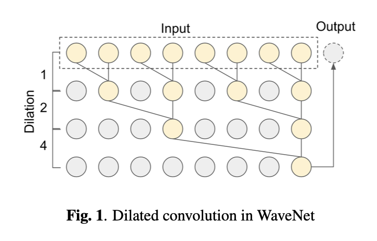
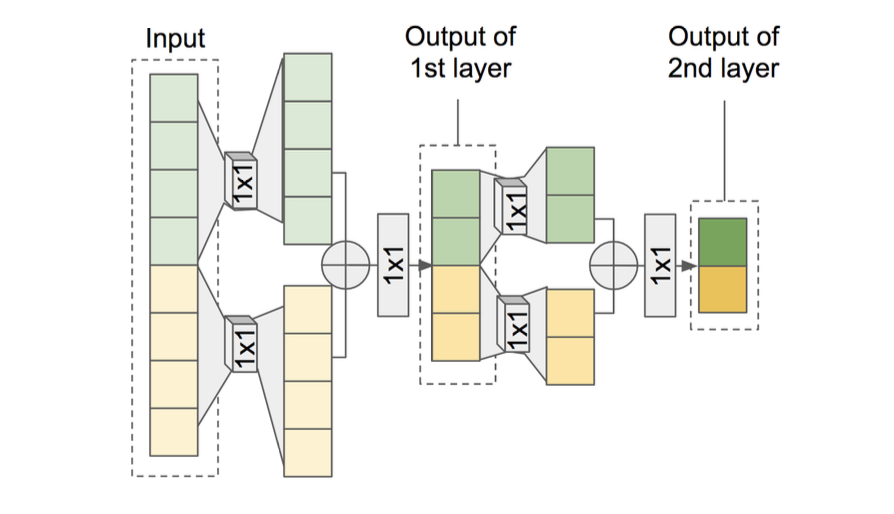

# 目的
WaveNet及びその並列化手法がニューラルボコーダ界隈で注目されているが，GPUが最低でも2枚は必要なモデルが
多いのが現状．もっと計算量が軽いニューラルボコーダはないかと探していたところ発見．内容理解のため要点を抑え，
読んでいて感じたことをメモする．

- [論文リンク](https://gfx.cs.princeton.edu/pubs/Jin_2018_FAR/)
- 参考：[Icassp2018 発表参加報告 FFTNet, Tactron2紹介](https://www.slideshare.net/KentaroTachibana1/icassp2018-fftnet-tactron2)

# FFTNetのここが凄い
- WaveNetの構造に着目，それをFFTアルゴリズムを参考に再構築．
- CPUでもリアルタイム計算可能な軽量&高速なモデル（1秒の音声の生成が0.81秒）
- 4つのトレーニングテクニックを入れることで，オリジナルのWaveNetよりも自然な音声に

# WaveNet
## おさらい
過去の情報のみを用いるCausal Convolutionと，層が深くなるにつれて畳み込むノードを離すDilated Convolutionを
組み合わせた自己回帰構造の深層生成モデル．詳しく知りたい方は[WaveNetまとめ](https://qiita.com/MasaEguchi/items/cd5f7e9735a120f27e2a)を参照
## 構造分析
以下はWaveNetの構造である．このDilated Convolutionの構造が，wavelet分析と似ていることに著者は気づいた．

>Z.Jin et al.2018

### wavelet分析
wavelet分析は時間-周波数解析において，低周波数は窓長を長く（周波数分解能を高く），高周波数では窓長を短く
（時間分解能を高く）する手法である．ポピュラーな時間-周波数解析である短時間フーリエ変換は，
周波数分解能と時間分解能がトレードオフの関係にあるため，両方の分解能を落とさずに解析を行いたい場合には
wavelet分析が向いている．詳しく知りたい方は[FFT分析とウェーブレット解析の違い｜株式会社エルメック](https://www.elmec-gms.com/software/weveletdif.html)を参照
### WaveNetの個人的な解釈
WaveNetの畳み込みのフィルタサイズ及び畳み込むノードの位置は，Waveletの窓長と対応する．高周波は一周期が
短いため近くのノードに，低周波は一周期が長いため遠くのノードに情報がある．よって，WaveNetは
高周波→低周波という流れで音声波形の分析を行い，後でその情報を統合（skip connection）することで，
次の時刻の音声波形の値を予測する確率モデルなのだと考えられる．
# FFTNet
## ネットワーク構築
WaveNetがWavelet分析の構造に似ていることから，同じ時間-周波数解析手法であるCooley-Tukeyアルゴリズムを
用いた高速フーリエ変換の構造で再構築を行う
### Cooley-Tukeyアルゴリズム
#### 簡単に言うと
Cooley-Tukeyアルゴリズムは，分割統治法に基づいたアルゴリズムである．奇数位置と偶数位置で波形を分割，
それを繰り返して再帰的に計算する．

#### 具体的な計算
入力系列$x_1,x_2,\dots,x_n$が与えられたとき，$k$番目の周波数成分の値は以下のようになる．

$$
\begin{aligned}
f_k &= \sum^{N-1}_{n=0}{x_ne^{-2\pi ink/N}} \\
&= \sum^{N/2-1}_{n=0}{x_{2n}e^{-2\pi i(2n)k/N}} + \sum^{N/2-1}_{n=0}{x_{2n+1}e^{-2\pi i(2n+1)k/N}}
\end{aligned}
$$
ここで$f_k = f(n, N)$と置くと

$$
\begin{aligned}
f(n,N)&=f(2n,N/2)+f(2n+1,N/2) \\
&=f(4n,N/4)+f(4n+1, N/4)+f(4n+2, N/4)+f(4n+3, N/4)\\
&=\dots
\end{aligned}
$$
と再帰計算ができる．
#### ちなみに
論文では最後の項が$f(4n+4,N/4)$となっているが間違っている可能性がある．$4n+4=4(n+1)$なので$4n$と1サンプルずれただけで同じ値の処理になってしまう．[高速フーリエ変換入門 -- Cooley-Tukey のアルゴリズム](http://wwwa.pikara.ne.jp/okojisan/stockham/cooley-tukey.html)を参照しても，$4n+3$のほうが正しいと思われる．

## ネットワーク構造

**Z.Jin et al.2018**

上図は，FFTNetの構造である．
### どうFFTアルゴリズムを導入したか
音声波形を分割，それぞれを処理してから加算するという構造を1×1Convを用いて構築．
### Cooley-Tukeyアルゴリズムとの違い
奇数位置と偶数位置で分割ではなく，音声波形を半分に分割して処理

### 具体的な処理
入力の音声波形$x_0,x_1,\dots,x_{N-1}$としたとき，$x_L=x_{0:N/2}$と$x_R=x_{N/2:N}$に分割する．
分割した$x_L,x_R$にそれぞれ1×1Convで畳み込みを行い，足し合わせる．その出力を$z$，1×1Convの重みをそれぞれ$W_L,W_R$とすると
$$
z = W_L*x_L + W_R*x_R
$$
となる．また，ここで条件付きベクトル$h$を，$x$と同様に分割，1×1Convで畳み込んだ特徴量を足すこともできる．
$h$の1×1Convの重みをそれぞれ$V_L,V_R$とすると
$$
z = (W_L*x_L + W_R*x_R) + (V_L*h_L + V_R*h_R)
$$
となる．$z$を1×1Convで畳み込み，ReLU関数を適用する．その出力を$x'$，1×1Convの重みを$W$とすると
$$
x'=ReLU(W(ReLU(z)))
$$
となる．これを，$x'$の長さが1になるまで繰り返す．例えば，入力波形の長さが1024サンプルの場合，
上記処理を10回適用することで長さが1になる．
最後に，全結合層を通してsoftmax関数を適用することで事後分布を求め，そこからサンプリングを行う．
最後はWaveNetと同様にして音声波形を得ている．

## トレーニングテクニック
WaveNetに匹敵するような品質にするため，FFTNetに4つのトレーニングテクニックを適用した．
これはWaveNetの品質向上にもつながった手法である．

### ゼロパディング
無音区間でノイズやゼロのみを出力してしまうため，ゼロパディングによって無音を学習
### 条件付きサンプリング
有音区間のとき，softmax関数を適用する前に係数$c(>1)$をかける．これにより，有音区間の事後分布をシャープにする
### ノイズ注入
ガウス雑音を入力音声に付与することで，ノイズにロバストネスになる
### ノイズ除去
入力音声にガウス雑音を付与したことで，出力がノイジーに．その対策として，生成音声に
スペクトラルサブトラクション法を適用してノイズ除去

# 評価
[サンプル音声](https://gfx.cs.princeton.edu/pubs/Jin_2018_FAR/clips/clips.php)．それぞれの手法の主観評価（MOS）の値も確認できる．
# 感じたこと

- WaveNetの並列化手法と違い，feed-forwardの計算量を削減することで高速化しているのが良い
- ノイズ注入とノイズ除去の方法に関しては，対処療法的なのでもう少しやり方があるのでは？
- 主観になってしまうが，リアル音声の品質があまり高くないと感じる（ノイジーというか，少し歪んでる？）ため，学習に用いるデータによってはトレーニングテクニックのいくつか不必要なのかも
- これは疑問だが，Loss関数が何を使ってるのか論文から読み取れなかった．WaveNetと同じで良いのかな？

# まとめ
FFTNetはCPUでもリアルタイム生成可能なモデルであるため，興味はある．しかし，トレーニングテクニックの処理や，サンプル音声を聞いて，モデル自体はまだまだ改良の余地がありそうだな，と感じる．
できれば実装してみたいと考えているが，他のWaveNet以外のニューラルボコーダの論文も読んでおきたい．

